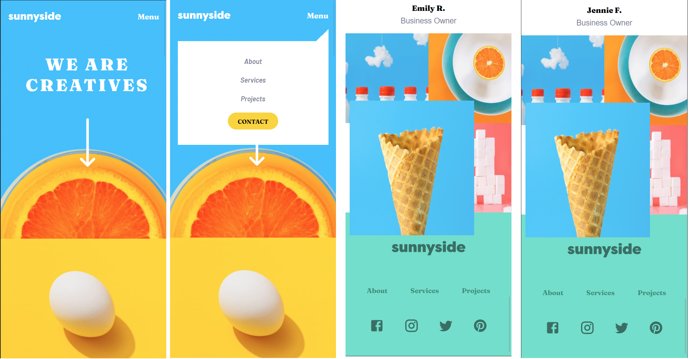

# Frontend Mentor - QR code component solution

This is a solution to the [Sunnyside agency landing page challenge on Frontend Mentor](https://www.frontendmentor.io/challenges/sunnyside-agency-landing-page-7yVs3B6ef). Frontend Mentor challenges help you improve your coding skills by building realistic projects.

## Table of contents

- [Overview](#overview)
  - [Screenshot](#screenshot)
  - [Links](#links)
- [My process](#my-process)
  - [Built with](#built-with)
  - [What I learned](#what-i-learned)
  - [Continued development](#continued-development)
- [Author](#author)
- [Acknowledgments](#acknowledgments)


## Overview

### Screenshot
- Desktop view


- Mobile View




### Links

- Solution URL: https://github.com/mrxshinji/sunnyside-landing-page
- Live Site URL: https://mrxshinji.github.io/sunnyside-landing-page


## My process

### Built with

- Semantic HTML5 markup
- Flexbox
- Mobile-first workflow
- [React](https://reactjs.org/) - JS library

### What I learned

- Scroll Trigger - triggering sectionVisible state and animate when active

```js
    const observer = new IntersectionObserver ((entries) => {
      entries.forEach(entry => {
        if (entry.target.id === "target1") {
          setSection1Visible(entry.isIntersecting);
        }
        if (entry.target.id === "target2") {
          setSection2Visible(entry.isIntersecting);
        } 
      }) 
    },options )
    allSection.forEach(section => observer.observe(section.current))
```

### Continued development

- Animation with React 

## Author

- Github - [https://github.com/mrxshinji]
- Frontend Mentor - [@mrxshinji](https://www.frontendmentor.io/profile/mrxshinji)

## Acknowledgments

-- Lots of people in stackoverflow after much googling on trying to get this right.

-- This Tutorial by Colby Fayock has very good explanation. [https://www.youtube.com/watch?v=r1auJEf9ISo]